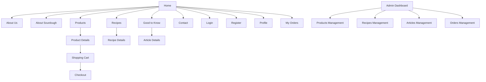
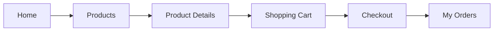
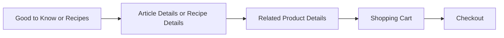
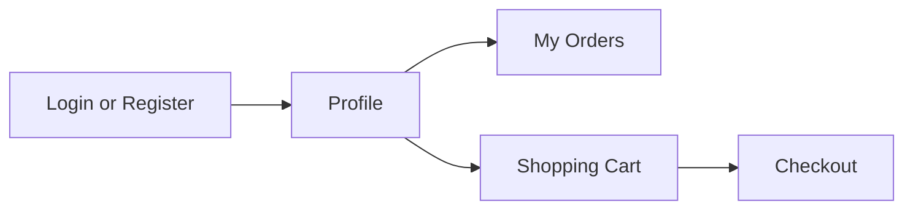
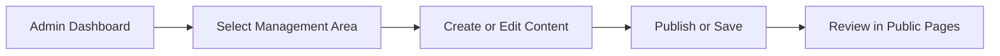

# Information Architecture - Sourdough Bakery Web Application

## 1) Purpose and Scope
This document defines the information architecture (IA) for the Sourdough Bakery web application before implementation.
It serves as the structural reference for page organization, navigation behavior, access levels, and user journeys.

### Project Context
- Application type: Multi-page artisan sourdough bakery website with integrated online shop
- Stack context: Vite, Vanilla JavaScript (ES Modules), Bootstrap 5, Supabase, Netlify
- IA goal: Make content discoverable, shopping flow intuitive, and administration scalable

## 2) IA Principles
- Clarity first: Primary navigation exposes the main customer intents (discover, shop, learn, contact)
- Progressive disclosure: Show broad categories first, then deeper details (list -> detail)
- Role-based access: Public content is open, customer operations require authentication, admin tools are isolated
- Consistent wayfinding: Global header, breadcrumbs on deep pages, and contextual links between related content
- Conversion support: Every content section should provide paths toward products, recipes, and checkout

## 3) Site Hierarchy

## 4) Navigation Structure

### 4.1 Global Primary Navigation (Header)
- Home
- About Us
- About Sourdough
- Products
- Recipes
- Good to Know
- Contact
- Cart icon (with item count)
- Account entry (Login/Register or Profile menu depending on session)

### 4.2 Secondary Navigation Patterns
- Breadcrumbs: Used on all detail and deep-flow pages
  - Product Details, Recipe Details, Article Details, Checkout, My Orders, Admin sections
- In-page section anchors (optional future enhancement):
  - Long-form pages such as About Sourdough and Article Details
- Contextual cards/links:
  - Product cards link to Product Details
  - Recipe cards link to Recipe Details
  - Article cards link to Article Details

### 4.3 Footer Navigation
- About Us
- Contact
- Key policy placeholders (future): Shipping, Returns, Privacy, Terms
- Newsletter subscription entry point (future)

### 4.4 Account and Role Navigation
- Guest state:
  - Login, Register visible
- Authenticated customer state:
  - Profile, My Orders, Logout visible
  - Cart and Checkout enabled
- Admin state:
  - Admin access entry to Dashboard and management modules

## 5) Route and Access Matrix

| Page | Suggested Route | Access | Primary Role |
|---|---|---|---|
| Home | / | Public | Guest/Customer/Admin |
| About Us | /about-us | Public | Guest/Customer/Admin |
| About Sourdough | /sourdough | Public | Guest/Customer/Admin |
| Products | /products | Public | Guest/Customer/Admin |
| Product Details | /products/:productId | Public | Guest/Customer/Admin |
| Recipes | /recipes | Public | Guest/Customer/Admin |
| Recipe Details | /recipes/:recipeId | Public | Guest/Customer/Admin |
| Good to Know | /good-to-know | Public | Guest/Customer/Admin |
| Article Details | /good-to-know/:articleId | Public | Guest/Customer/Admin |
| Contact | /contact | Public | Guest/Customer/Admin |
| Login | /login | Public (guest-only intent) | Guest |
| Register | /register | Public (guest-only intent) | Guest |
| Profile | /profile | Protected | Authenticated Customer/Admin |
| Shopping Cart | /cart | Protected | Authenticated Customer/Admin |
| Checkout | /checkout | Protected | Authenticated Customer/Admin |
| My Orders | /my-orders | Protected | Authenticated Customer/Admin |
| Admin Dashboard | /admin-dashboard | Admin only | Admin |
| Products Management | /manage-products | Admin only | Admin |
| Recipes Management | /manage-recipes | Admin only | Admin |
| Articles Management | /manage-articles | Admin only | Admin |
| Orders Management | /manage-orders | Admin only | Admin |

## 6) User Journeys

### 6.1 Discovery to Purchase Journey

### 6.2 Content Engagement to Purchase Journey

### 6.3 Authentication and Account Journey

### 6.4 Admin Operational Journey

## 7) Page Catalog

## 7.1 Public Pages

### Home
- Purpose: Present bakery brand, featured content, and key conversion entry points
- Main content: Hero section, featured products, featured recipes/articles, value proposition, testimonials (future)
- Navigation entry points: Primary nav, logo click, footer
- Components used: Header, hero banner, featured cards, CTA blocks, footer
- Future functionality: Personalized recommendations, seasonal campaign modules, newsletter signup

### About Us
- Purpose: Explain bakery story, mission, and craftsmanship values
- Main content: Brand story, team section, process highlights, trust indicators
- Navigation entry points: Header, footer, contextual links from Home
- Components used: Header, content sections, media blocks, footer
- Future functionality: Timeline view, baker profiles, awards/certifications section

### About Sourdough
- Purpose: Educate users about sourdough basics and benefits
- Main content: What sourdough is, fermentation process, health/taste benefits, FAQ
- Navigation entry points: Header, links from Home/Recipes/Articles
- Components used: Header, educational content blocks, FAQ accordion, footer
- Future functionality: Interactive starter guide, downloadable primer, glossary filters

### Products
- Purpose: Show available products and support product exploration
- Main content: Product listing grid, category/filter controls, sorting, quick highlights
- Navigation entry points: Header, CTA from Home, related links from content pages
- Components used: Header, filter bar, product cards, pagination/load more, footer
- Future functionality: Advanced filters, stock indicators, favorite/wishlist actions

### Product Details
- Purpose: Provide complete product information and drive add-to-cart action
- Main content: Product images, description, ingredients/allergens, pricing, quantity selector, related products
- Navigation entry points: Products list, related links, search results (future)
- Components used: Header, breadcrumb, image gallery, product info panel, related products, footer
- Future functionality: Reviews/ratings, subscription purchase, bundle suggestions

### Recipes
- Purpose: Inspire users with recipe ideas and strengthen product usage context
- Main content: Recipe list/cards, difficulty/time metadata, tags/categories
- Navigation entry points: Header, Home featured section, product detail cross-links
- Components used: Header, recipe cards, filter chips, pagination/load more, footer
- Future functionality: Saved recipes, dietary filters, user-generated recipes

### Recipe Details
- Purpose: Provide full recipe instructions and connect to relevant products
- Main content: Ingredients, step-by-step method, timing, serving size, linked products
- Navigation entry points: Recipes list, related content, search results (future)
- Components used: Header, breadcrumb, recipe detail layout, related products, footer
- Future functionality: Print mode, step-by-step cooking mode, adjustable servings

### Good to Know
- Purpose: Offer educational/editorial articles and improve SEO/content depth
- Main content: Article listing, categories/topics, featured article
- Navigation entry points: Header, Home featured content, footer
- Components used: Header, article cards, category filters, pagination/load more, footer
- Future functionality: Search by topic, author pages, newsletter segmenting

### Article Details
- Purpose: Present full long-form article with contextual commerce links
- Main content: Article body, media embeds, key takeaways, related articles/products
- Navigation entry points: Good to Know list, contextual links from other pages
- Components used: Header, breadcrumb, article layout, related content blocks, footer
- Future functionality: Reading progress indicator, share tools, comments (moderated)

### Contact
- Purpose: Provide direct communication and support channels
- Main content: Contact form, location/map, business hours, social links
- Navigation entry points: Header, footer, contextual CTAs
- Components used: Header, form module, contact info blocks, map embed area, footer
- Future functionality: Structured support categories, chatbot/live support handoff

## 7.2 Authenticated Pages

### Login
- Purpose: Authenticate existing users
- Main content: Login form, validation messaging, password recovery entry (future)
- Navigation entry points: Header account entry, checkout/cart guard redirects
- Components used: Header, auth form card, status alerts, footer
- Future functionality: Social login, magic link login, remember-device controls

### Register
- Purpose: Create new user accounts
- Main content: Registration form, consent checkboxes, validation feedback
- Navigation entry points: Header account entry, checkout/cart guard redirects, login switch link
- Components used: Header, auth form card, status alerts, footer
- Future functionality: Progressive onboarding profile setup, marketing preferences

### Profile
- Purpose: Manage personal account data and preferences
- Main content: Account details, address placeholders, profile actions
- Navigation entry points: Account menu after login, post-auth redirect
- Components used: Header, profile summary card, editable form sections, footer
- Future functionality: Address book, payment method vault references, notification preferences

### Shopping Cart
- Purpose: Review selected items before purchase
- Main content: Cart items, quantity updates, subtotal summary, remove actions
- Navigation entry points: Cart icon, add-to-cart action from Product Details
- Components used: Header, cart list, order summary panel, CTA to Checkout, footer
- Future functionality: Promo codes, shipping estimation, saved-for-later

### Checkout
- Purpose: Complete purchase flow
- Main content: Order summary, customer details, delivery method, payment step placeholders
- Navigation entry points: Shopping Cart CTA, guarded direct route
- Components used: Header, step indicator, checkout form groups, summary panel, footer
- Future functionality: Multi-step checkout, payment provider integration, order confirmation email trigger

### My Orders
- Purpose: Display customer purchase history and order statuses
- Main content: Order list, status badges, order detail drill-down placeholder
- Navigation entry points: Account menu, post-checkout confirmation flow
- Components used: Header, orders table/cards, filter controls, footer
- Future functionality: Reorder action, invoice download, shipment tracking integration

## 7.3 Admin Pages

### Dashboard
- Purpose: Give admins a control center snapshot
- Main content: KPIs (orders, revenue, low stock placeholders), quick links to management pages
- Navigation entry points: Admin-only entry, post-admin-login route
- Components used: Admin header/nav, KPI cards, quick action panels
- Future functionality: Date-range analytics, alert center, role-based widgets

### Products Management
- Purpose: Create, edit, archive, and review products
- Main content: Product table/list, CRUD forms, status controls
- Navigation entry points: Dashboard quick links, admin sidebar
- Components used: Admin nav, data table, modal/form panels, action toolbars
- Future functionality: Bulk actions, inventory sync, media library integration

### Recipes Management
- Purpose: Manage recipe content lifecycle
- Main content: Recipe list, CRUD controls, publish status
- Navigation entry points: Dashboard quick links, admin sidebar
- Components used: Admin nav, data table/cards, editor forms, action buttons
- Future functionality: Rich text editor, media embedding, version history

### Articles Management
- Purpose: Manage educational/editorial content
- Main content: Article list, CRUD controls, publication state
- Navigation entry points: Dashboard quick links, admin sidebar
- Components used: Admin nav, content table/cards, editor forms, status badges
- Future functionality: Scheduling, SEO metadata fields, author workflow

### Orders Management
- Purpose: Monitor and process customer orders
- Main content: Orders table, status updates, order detail panel
- Navigation entry points: Dashboard quick links, admin sidebar
- Components used: Admin nav, order table, status controls, detail drawer/panel
- Future functionality: Fulfillment workflow, refund support, export/reporting

## 8) Relationships Between Pages

## 8.1 Key Relationship Map
- Home routes users to all major public destinations
- Listing pages route to detail pages:
  - Products -> Product Details
  - Recipes -> Recipe Details
  - Good to Know -> Article Details
- Product Details routes to Shopping Cart
- Shopping Cart routes to Checkout
- Checkout routes to My Orders (post-purchase)
- Login/Register route users to Profile and guarded destinations
- Admin Dashboard routes to each management module

## 8.2 Cross-Linking Strategy

| Source Page | Target Page | Relationship Type | Goal |
|---|---|---|---|
| Recipe Details | Product Details | Contextual recommendation | Increase product conversion |
| Article Details | Product Details | Educational-to-commerce bridge | Convert learning intent |
| Product Details | Recipes | Usage inspiration | Increase confidence and engagement |
| Home | Products/Recipes/Good to Know | Promotional/featured | Shorten time to key actions |
| Profile | My Orders | Account continuity | Improve customer retention |
| Dashboard | All admin management pages | Operational control | Faster admin workflows |

## 9) Access and Guard Rules
- Public pages: Accessible to all visitors
- Protected pages: Require authenticated session
  - Profile, Shopping Cart, Checkout, My Orders
- Guest intent pages:
  - Login and Register should redirect authenticated users to Profile (or previous intended destination)
- Admin pages: Require admin role claims/permissions
  - Dashboard, Products Management, Recipes Management, Articles Management, Orders Management
- Unauthorized handling:
  - Non-authenticated user on protected route -> redirect to Login with return path
  - Non-admin user on admin route -> show Access Denied view and safe navigation options

## 10) Component Reuse Model

| Component | Reused In |
|---|---|
| Header | All public and customer pages |
| Footer | All public and customer pages |
| Breadcrumb | All detail pages, Checkout, My Orders, admin detail contexts |
| Card Grid | Products, Recipes, Good to Know |
| Detail Layout | Product Details, Recipe Details, Article Details |
| Form Modules | Login, Register, Profile, Contact, Checkout, admin CRUD forms |
| Table/List Modules | My Orders, all admin management pages |

## 11) Future Expansion Zones
- Search results page spanning products, recipes, and articles
- Wishlist/favorites area tied to Profile
- Order details page under My Orders
- Policy and legal content pages linked in footer
- Multi-language architecture layer
- Role segmentation beyond admin (editor, fulfillment, support)

## 12) IA Acceptance Checklist
- Site hierarchy includes all required public, authenticated, and admin pages
- Navigation and wayfinding are defined for header, footer, breadcrumbs, and contextual links
- User journeys cover discovery, purchase, account, and admin operations
- Access model distinguishes public, protected, and admin-only routes
- Each required page has purpose, main content, entry points, components, and future functionality
- Inter-page relationships and cross-linking strategy are documented

